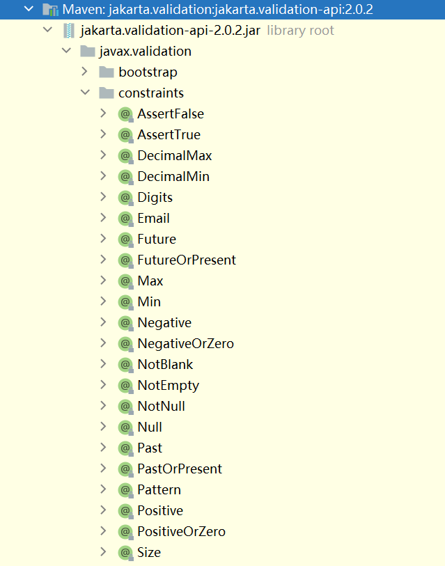
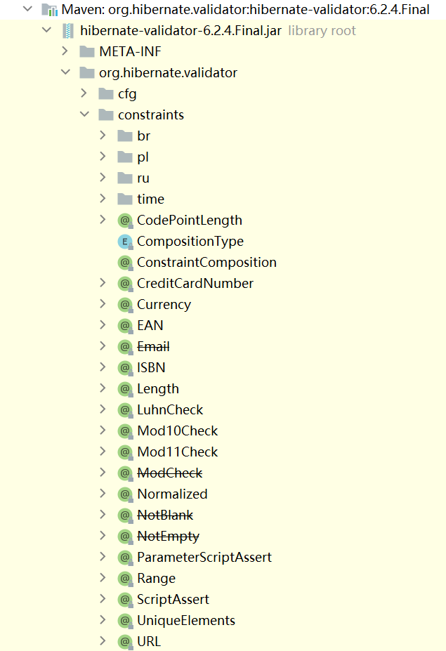

# bean-validation

[java代码简洁之道 用bean validation和hibernate validator提升代码质量,让代码少点臭味道](https://www.bilibili.com/video/BV17i4y157Ah)

[Bean Validation完结篇：你必须关注的边边角角（约束级联、自定义约束、自定义校验器、国际化失败消息...）](https://www.bbsmax.com/A/kjdwljbEzN/)

[这可能是你见过hibernate-validator最全国际化方案](https://juejin.cn/post/6979165353481863182)

## 常用的校验约束注解





## 约束和校验类的绑定原理

XxxValidator 校验 @Xxx，如：`NotBlankValidator` 校验 `@NotBlank`

XxxValidator 实现接口 `javax.validation.ConstraintValidator`

XxxValidator 和 @Xxx 的绑定关系在`org.hibernate.validator.internal.metadata.core.ConstraintHelper` 设置

## 约束级联（级联校验）

## 自定义约束+自定义校验器

## 国际化失败消息

每个约束定义中都包含有一个用于提示验证结果的消息模版message，并且在声明一个约束条件的时候,你可以通过这个约束注解中的message属性来重写默认的消息模版（这是自定义message最简单的一种方式）。

如果在校验的时候,这个约束条件没有通过,那么你配置的MessageInterpolator插值器会被用来当成解析器来解析这个约束中定义的消息模版, 从而得到最终的验证失败提示信息。

默认使用的插值器是org.hibernate.validator.messageinterpolation.ResourceBundleMessageInterpolator，它借助org.hibernate.validator.spi.resourceloading.ResourceBundleLocator来获取到国际化资源属性文件从而填充模版内容~

资源解析器默认使用的实现是PlatformResourceBundleLocator，在配置Configuration初始化的时候默认被赋值：

```java
private ConfigurationImpl() {
    this.validationBootstrapParameters = new ValidationBootstrapParameters();
    // 默认的国际化资源文件加载器USER_VALIDATION_MESSAGES值为：ValidationMessages
    // 这个值就是资源文件的文件名~~~~
    this.defaultResourceBundleLocator = new PlatformResourceBundleLocator(
        ResourceBundleMessageInterpolator.USER_VALIDATION_MESSAGES
    );
    this.defaultTraversableResolver = TraversableResolvers.getDefault();
    this.defaultConstraintValidatorFactory = new ConstraintValidatorFactoryImpl();
    this.defaultParameterNameProvider = new DefaultParameterNameProvider();
    this.defaultClockProvider = DefaultClockProvider.INSTANCE;
}
```

这个解析器会尝试解析模版中的占位符( 大括号括起来的字符串，形如这样{xxx})。

它解析message的核心代码如下（比如此处message模版是{javax.validation.constraints.NotNull.message}为例）：

```java
public abstract class AbstractMessageInterpolator implements MessageInterpolator {
    ...
        private String interpolateMessage(String message, Context context, Locale locale) throws MessageDescriptorFormatException {
        // 如果message消息木有占位符，那就直接返回  不再处理了~
        // 这里自定义的优先级是最高的~~~
        if ( message.indexOf( '{' ) < 0 ) {
            return replaceEscapedLiterals( message );
        }
        // 调用resolveMessage方法处理message中的占位符和el表达式
        if ( cachingEnabled ) {
            resolvedMessage = resolvedMessages.computeIfAbsent( new LocalizedMessage( message, locale ), lm -> resolveMessage( message, locale ) );
        } else {
            resolvedMessage = resolveMessage( message, locale );
        }
        ...
    }
    private String resolveMessage(String message, Locale locale) {
        String resolvedMessage = message;
        // 获取资源ResourceBundle三部曲
        ResourceBundle userResourceBundle = userResourceBundleLocator.getResourceBundle( locale );
        ResourceBundle constraintContributorResourceBundle = contributorResourceBundleLocator.getResourceBundle( locale );
        ResourceBundle defaultResourceBundle = defaultResourceBundleLocator.getResourceBundle( locale );
        ...
    }
}
```

对如上message的处理步骤大致总结如下：

若没占位符符号{需要处理，直接返回（比如我们自定义message属性值全是文字，就直接返回了）~
有占位符或者EL，交给resolveMessage()方法从资源文件里拿内容来处理~
拿取资源文件，按照如下三个步骤寻找：

1. userResourceBundleLocator：去用户自己的classpath里面去找资源文件（默认名字是ValidationMessages.properties，当然你也可以使用国际化名）

2. contributorResourceBundleLocator：加载贡献的资源包

3. defaultResourceBundle：默认的策略。去这里于/org/hibernate/validator加载ValidationMessages.properties
需要注意的是，如上是加载资源的顺序。无论怎么样，这三处的资源文件都会加载进内存的（并无短路逻辑）。进行占位符匹配的时候，依旧遵守这规律：

1. 最先用自己当前项目classpath下的资源去匹配资源占位符，若没匹配上再用下一级别的资源~~~

2. 规律同上，依次类推，递归的匹配所有的占位符（若占位符没匹配上，原样输出，并不是输出null哦~）
需要注意的是，因为{在此处是特殊字符，若你就想输出{，请转义：\{
