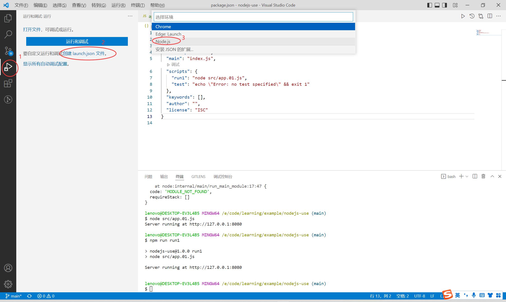
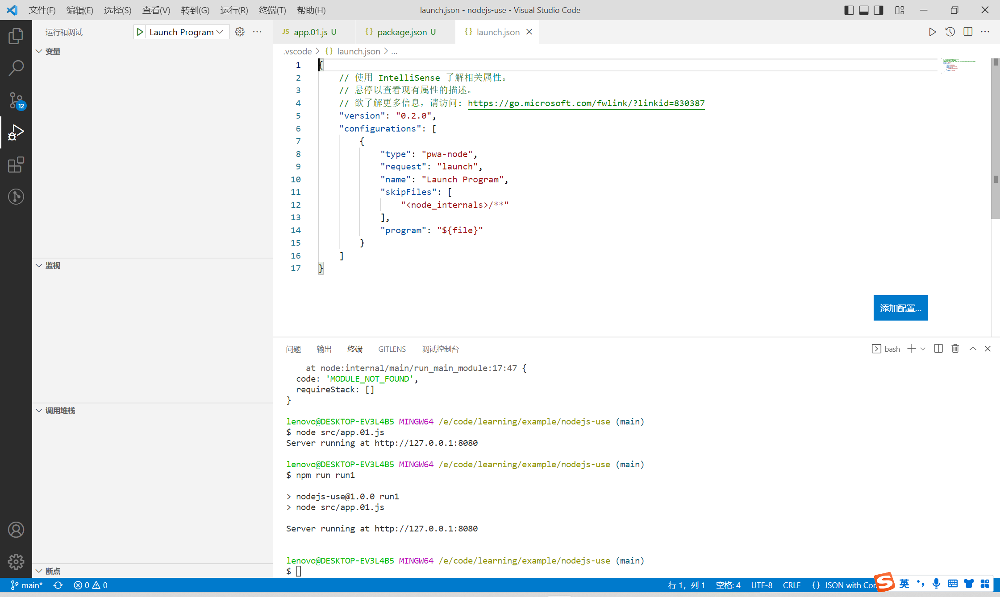
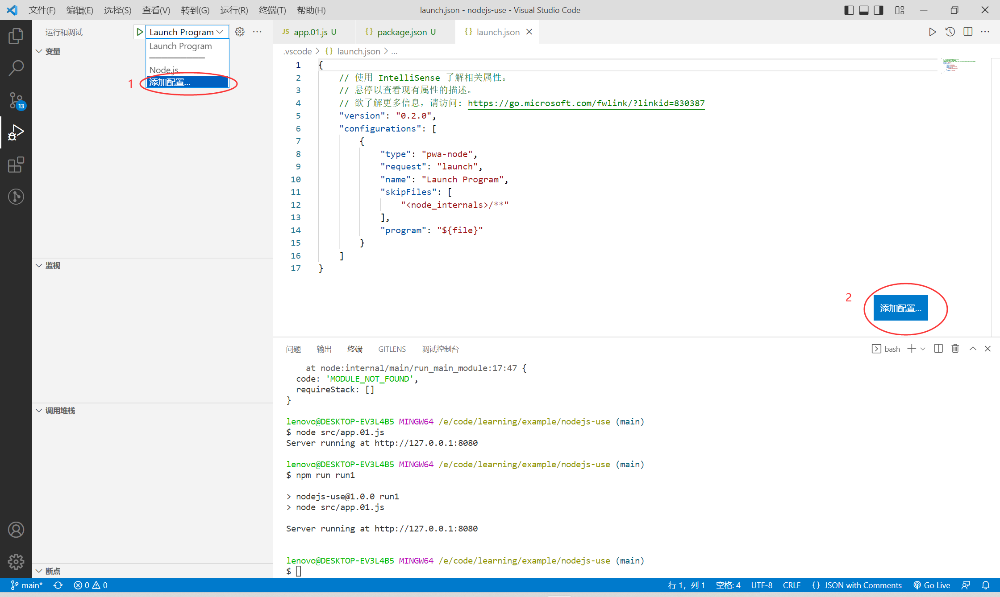

# VSCode

## 调试技巧 - Debug - launch.json

### 创建launch.json



生成的文件内容如下：



### 配置launch.json

添加配置的两种方式：



<span style="font-weight:bold;color:red;">启动配置必须设定请求类型，属性request ， 分为 launch（启动）和 attach（附加）两种。</span>

launch（启动）和 attach（附加）共有的属性

| 属性      | 说明                     | 必填 | 可选值                            |
| --------- | ------------------------ | ---- | --------------------------------- |
| type      |                          |      |                                   |
| name      |                          | 是   |                                   |
| request   | 请求类型                 | 是   | launch（启动） <br>attach（附加） |
| skipFiles | 指定跳过单步调试的代码   |      |                                   |
| address   | TCP/IP地址，用于远程调试 |      |                                   |
| port      | 调试使用的端口           |      |                                   |

<span style="font-weight:bold;color:red;">launch（启动）的属性</span>

| 属性              | 说明                                                         |
| ----------------- | ------------------------------------------------------------ |
| program           | 指定调试入口文件地址                                         |
| args              | 传递给程序的参数,可在process.argv拿到                        |
| cwd               | 指定程序启动调试的目录，当vscode启动目录不是项目根目录，并且调试npm script时非常有用 |
| runtimeExecutable | 设置运行时可执行文件路径，默认是node，也可以是其他的执行程序，如npm、nodemon |
| runtimeArgs       | 传递给运行时可执行文件的参数                                 |
| env               | 添加额外的环境变量                                           |
| envFile           | 文件加载环境变量                                             |

<span style="font-weight:bold;color:red;">attach（附加）的属性</span>

| 属性 | 说明 |
| ---- | ---- |
|      |      |

更多配置参考：

[https://juejin.cn/post/6844904198702645262](https://juejin.cn/post/6844904198702645262)

<span style="font-weight:bold;color:red;">attach（附加）调试，需要启动时开启调试服务</span>

Node.js 调试服务默认关闭，需要通过 --inspect 或 --inspect-brk 标识符开启，服务的默认地址和端口也可通过 node --inspect=host:port 指定。默认地址和端口是：127.0.0.1:9229

- node --inspect app.js 开启调试服务，端口为 9229
- node --inspect=3003 app.js 开启调试服务，端口为 3003
- node --inspect=192.168.0.101 app.js 开启调试服务，地址为 192.168.0.101:9229
- node --inspect=192.168.0.101:3003 app.js 开启调试服务，地址为 192.168.0.101:3003

# 前端模块化规范

## commonjs

mod.js

```javascript
function fun() {}

// 导出模块
module.exports = {
    fun
};
```

app.js

```javascript
// 导入模块
const mod = require("./mod");
const { fun } = require("./mod");
```

## es6

mod.js

```javascript
// 导出模块
export function fun() {}
```

app.js

```javascript
// 导入模块
import mod from "./mod.js";
import { fun } from "./mod.js";
```

# 第三方库

[https://www.npmjs.com/](https://www.npmjs.com/)

## nodemon

[nodemon](https://www.npmjs.com/package/nodemon) is a tool that helps develop Node.js based applications by automatically restarting the node application when file changes in the directory are detected.

nodemon does not require any additional changes to your code or method of development. nodemon is a replacement wrapper for node. To use nodemon, replace the word node on the command line when executing your script.

## axios

[axios](https://github.com/axios/axios): Promise based HTTP client for the browser and node.js. 

```shell
npm install axios
```

## json-server

[json-server](https://www.npmjs.com/package/json-server): Get a full fake REST API with zero coding in less than 30 seconds (seriously).

```shell
npm install -g json-server
```

```shell
json-server --watch db.json
```

## jsonserver

[jsonserver](https://www.npmjs.com/package/jsonserver): Small JSON file server for REST API mock.

```shell
npm install -g jsonserver
```

```shell
jsonserver --path path/to/file.json --port 5000
```

## koa

| 模块                                                       | 说明                                                         |
| ---------------------------------------------------------- | ------------------------------------------------------------ |
| [koa](https://www.npmjs.com/package/koa)                   |                                                              |
| [koa-compose](https://www.npmjs.com/package/koa-compose)   | Compose the given middleware and return middleware.          |
| [koa-router](https://www.npmjs.com/package/koa-router)     | [koa-router](https://github.com/ZijianHe/koa-router) is a Router middleware for Koa. |
| koa-bodyparser                                             | koa.js并没有内置Request Body的解析器，当我们需要解析请求体时需要加载额外的中间件，<br/>官方提供的koa-bodyparser是个很不错的选择，<br/>支持x-www-form-urlencoded, application/json等格式的请求体，<br/>但不支持form-data的请求体，需要借助 formidable 这个库，<br/>也可以直接使用 koa-body 或 koa-better-body |
| [koa-compress](https://www.npmjs.com/package/koa-compress) | 当响应体比较大时，我们一般会启用类似Gzip的压缩技术减少传输内容，<br/>koa-compress提供了这样的功能，可根据需要进行灵活的配置。 |
| [koa-logger](https://www.npmjs.com/package/koa-logger)     |                                                              |
| koa-jwt                                                    |                                                              |

<span style="font-weight:bold;color:red;">异常统一处理</span>

[Error Handling](https://github.com/koajs/koa/blob/HEAD/docs/error-handling.md)

[Koa 中的错误处理解析](https://www.jb51.net/article/159304.htm)

[Nodejs的运行日志怎么做？](https://www.zhihu.com/question/27607741)

## log4js

[https://www.npmjs.com/package/log4js](https://www.npmjs.com/package/log4js)

[https://log4js-node.github.io/log4js-node/](https://log4js-node.github.io/log4js-node/)

```shell
npm install log4js
```

# 单元测试

[https://juejin.cn/post/6907555445628469255](https://juejin.cn/post/6907555445628469255)

## 测试框架

### jest

[jest](https://jestjs.io/)，一个功能全面的'零配置'测试框架,几乎国内所有的大型互联网公司都在使用。

jest是 facebook 出品的一个测试框架, 相对于其他测试框架, 最大的特点就是内置了常用的测试工具, 比如 自带断言expect, 测试覆盖率工具 , ui测试工具, mock能力 等, 同时可以收集成很多插件, 与主流的软件库 (vscode)配合测试, 比如： TypeScript, React, Vue 等, 真正实现了开箱即用。

jest 相比 mocha有更为清晰的说明文档, 并且和 ava 一样支持并行测试提供效率。

### mocha

[mocha](https://mochajs.org/)

[https://mochajs.org/#command-line-usage](https://mochajs.org/#command-line-usage)

```shell
npm install --save mocha
npm install --save-dev mocha
npm uninstall mocha

npm install --global mocha
npm uninstall --global mocha
```

## 打桩

[sinon](https://github.com/sinonjs/sinon)

### nock

[https://github.com/nock/nock](https://github.com/nock/nock)

HTTP server mocking and expectations library for Node.js。

Nock can be used to test modules that perform HTTP requests in isolation.

```shell
npm install --save-dev nock
```

## 断言

[assert](https://nodejs.org/docs/latest-v12.x/api/assert.html)：Node 原生支持的断言模块 支持 TDD

[should](https://github.com/tj/should.js): 支持BDD

[expect](https://github.com/Automattic/expect.js): 支持 BDD

### chai

[Chai](https://github.com/chaijs/chai) is a BDD / TDD assertion library for node and the browser that can be delightfully paired with any javascript testing framework.

Chai is an assertion library, similar to Node's built-in assert. It makes testing much easier by giving you lots of assertions you can run against your code.

```shell
npm install --save-dev chai
```
```javascript
const chai = require('chai');  
const assert = chai.assert;    // Using Assert style
const expect = chai.expect;    // Using Expect style
const should = chai.should();  // Using Should style
```

For more information or to download plugins, view the [documentation](http://chaijs.com/).

**Expect/Should**: [https://www.chaijs.com/api/bdd/](https://www.chaijs.com/api/bdd/)

**Assert**: [https://www.chaijs.com/api/assert/](https://www.chaijs.com/api/assert/)

## HTTP test

### chai-http

[chai-http](https://www.npmjs.com/package/chai-http), HTTP integration testing with Chai assertions.

chai-http, 是基于chai扩展的插件，可用于测试与http请求相关的逻辑代码。

### supertest

[supertest](https://www.npmjs.com/package/supertest)，HTTP assertions made easy via superagent.

## nyc

[nyc](https://www.npmjs.com/package/nyc), 测试覆盖度工具

# 多环境切换

|                      | Windows（进入cmd窗口）  | Linux / Mac                |
| -------------------- | ----------------------- | -------------------------- |
| 检查环境变量是否存在 | set NODE_ENV            | echo $NODE_ENV             |
| 添加环境变量         | set NODE_ENV=production | export NODE_ENV=production |
| 删除环境变量         | set NODE_ENV=           | unset NODE_ENV             |
| 显示全部环境变量     |                         | env                        |

Windows 版 package.json：

```json
{
    "scripts": {
        "start-dev": "set NODE_ENV=development&& node src/app.js",
        "start-test": "set NODE_ENV=test&& node src/app.js",
        "start-prod": "set NODE_ENV=production&& node src/app.js"
    }
}
```

Linux / Mac 版 package.json

```json
{
    "scripts": {
        "start-dev": "export NODE_ENV=development&& node src/app.js",
        "start-test": "export NODE_ENV=test&& node src/app.js",
        "start-prod": "export NODE_ENV=production&& node src/app.js"
    }
}
```

跨平台版 package.json 使用 cross-env 设置环境变量：

```json
{
    "scripts": {
        "start-dev": "cross-env NODE_ENV=development node src/app.js",
        "start-test": "cross-env NODE_ENV=test node src/app.js",
        "start-prod": "cross-env NODE_ENV=production node src/app.js",
    }
}
```

app.js

```javascript
const config = require("./config");
config();

console.log(process.env.NODE_ENV);

const Koa = require('koa');
const app = new Koa();

const port = process.env.PORT || 7777;
const server = app.listen(port, () => {
    console.log(`Server is running at http://localhost:${port}`)
});

module.exports = server;
```

config.js

```javascript
const dotenv = require('dotenv');

module.exports = () => {
    switch (process.env.NODE_ENV) {
        case "development": {
            dotenv.config({ path: '.env.development' });
            break;
        }
        case "test": {
            dotenv.config({ path: '.env.test' });
            break;
        }
        case "production": {
            dotenv.config({ path: '.env.production' });
            break;
        }
        default: {
            dotenv.config();
            break;
        }
    }
}
```
