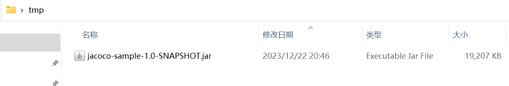

# JaCoCo

[https://www.jacoco.org/jacoco/](https://www.jacoco.org/jacoco/)

## Getting started 

### Prerequisites

prepare a jar



download jacoco from [https://www.jacoco.org/jacoco/](https://www.jacoco.org/jacoco/)


unzip, copy jacocoagent.jar and jacococli.jar to tmp


### Start Java agent

A Java agent can be activated with the following JVM option:

```shell
-javaagent:[yourpath/]jacocoagent.jar=[option1]=[value1],[option2]=[value2]
```

```shell
java -javaagent:jacocoagent.jar=includes=*,output=tcpserver,address=localhost,port=6300,append=true -jar jacoco-sample-1.0-SNAPSHOT.jar
```

### Dump exec file

Request execution data from a JaCoCo agent running in 'tcpserver' output mode. 

```shell
java -jar jacococli.jar dump [--address <address>] --destfile <path> [--help] [--port <port>] [--quiet] [--reset] [--retry <count>]
```

```shell
java -jar jacococli.jar dump --address 127.0.0.1 --port 6300 --destfile jacoco.exec
```

### Generate report

Generate reports in different formats by reading exec and Java class files.

```shell
java -jar jacococli.jar report [<execfiles> ...] --classfiles <path> [--csv <file>] [--encoding <charset>] [--help] [--html <dir>] [--name <name>] [--quiet] [--sourcefiles <path>] [--tabwith <n>] [--xml <file>]
```

```shell
java -jar jacococli.jar report jacoco.exec --sourcefiles C:\Users\lenovo\Desktop\jacoco-sample\src\main\java --classfiles C:\Users\lenovo\Desktop\jacoco-sample\target\classes --encoding utf-8 --html report --xml report.xml
```


### References

[https://www.jacoco.org/jacoco/trunk/doc/agent.html](https://www.jacoco.org/jacoco/trunk/doc/agent.html)

[https://www.jacoco.org/jacoco/trunk/doc/cli.html](https://www.jacoco.org/jacoco/trunk/doc/cli.html)

## Maven Plug-in

[https://www.jacoco.org/jacoco/trunk/doc/maven.html](https://www.jacoco.org/jacoco/trunk/doc/maven.html)

### Prerequisites

The JaCoCo Maven plug-in requires

- Maven 3.0 or higher and
- Java 1.8 or higher for the Maven runtime, Java 1.5 or higher for the test executor.

### Usage

The Maven plug-in can be included in your build with the following declaration. Please check [here](http://search.maven.org/#search|ga|1|g%3Aorg.jacoco a%3Ajacoco-maven-plugin) for the latest release version in the repository.

```shell
# 查看mvn的jdk版本
mvn -v

# 临时切换jdk版本，解决Fatal error compiling: 无效的标记: --release
export JAVA_HOME=D:/Java/jdk-17.0.1

# 查看mvn的jdk版本
mvn -v

# 编译源码，执行测试用例并生成JaCoCo报告
mvn clean test
```


