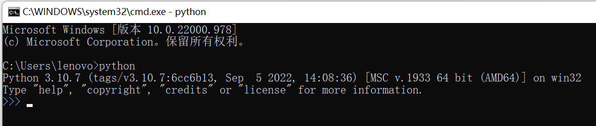

# 环境搭建

## 在Windows下安装Python

[https://www.python.org/downloads/](https://www.python.org/downloads/)

## 在VSCode中搭建Python环境

## 在IDEA中搭建Python环境

# 相关资料

[Python 标准库](https://docs.python.org/zh-cn/3/library/index.html)

[Python 基础教程 | 菜鸟教程](https://m.runoob.com/python/)
