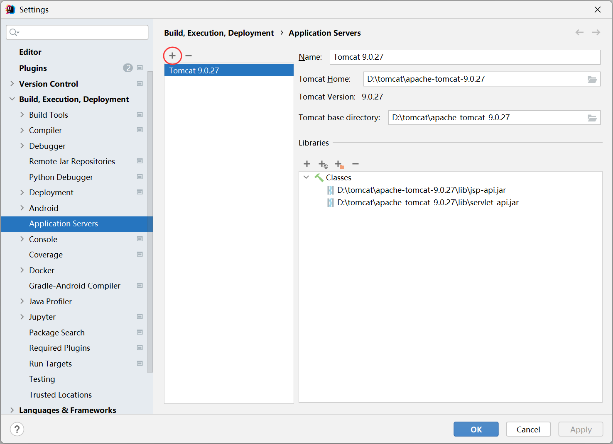
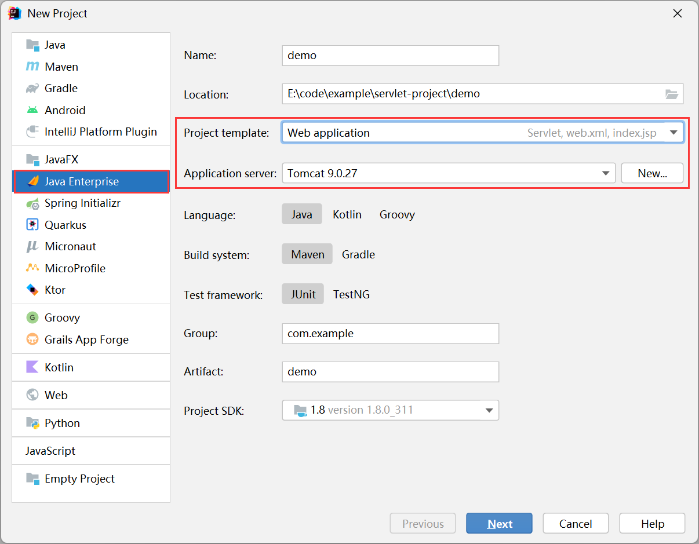
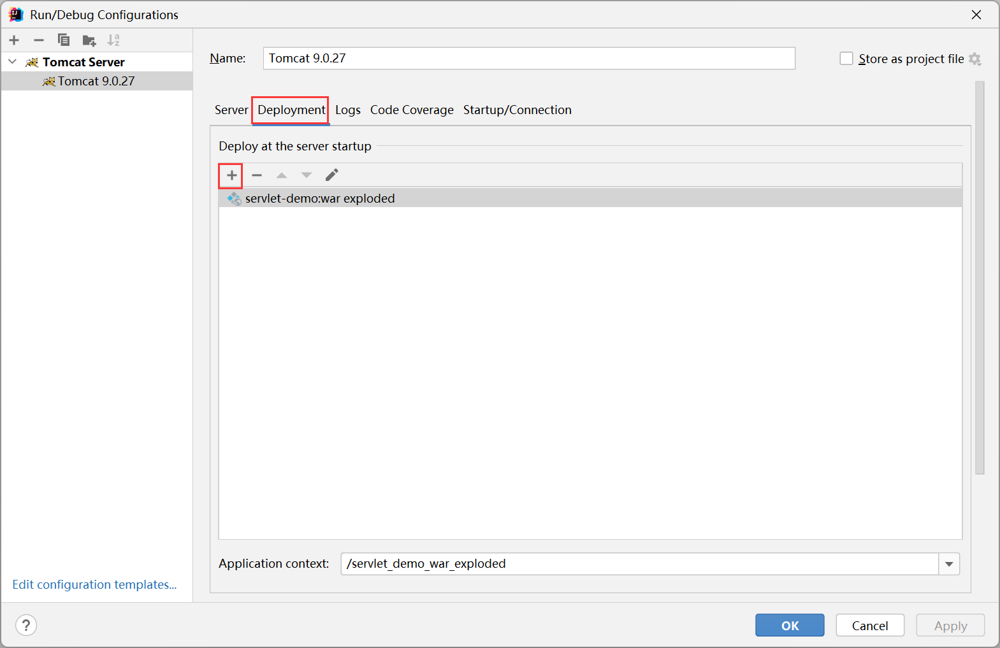
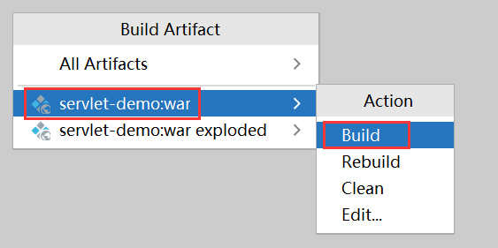

[千锋教育Servlet视频教程：Servlet从入门到精通](https://www.bilibili.com/video/BV1Ga4y1Y7Ah)

[尚硅谷Spring注解驱动教程(雷丰阳源码级讲解) - 53_尚硅谷_servlet3.0-简介&测试](https://www.bilibili.com/video/BV1gW411W7wy/?p=53)

[https://www.jcp.org/en/home/index](https://www.jcp.org/en/home/index)

[https://tomcat.apache.org/](https://tomcat.apache.org/)

# Tomcat服务器目录结构

```
apache-tomcat-9.0.27
├─bin
│      shutdown.bat	// 关闭Tomcat服务器
│      startup.bat	// 启动Tomcat服务器
├─conf
│  │  server.xml	// tomcat配置
│  └──web.xml
├─lib
├─logs
├─temp
└─webapps			// release的war包放这里，tomcat服务器启动时会自动解压war包
   └─test_web		// 我们自己的发布的web工程
       │  index.html
       ├─images
       │      tomcat.png
       └─WEB-INF		// 存放项目核心内容，外部不可访问
           │  web.xml	// web工程配置文件
           ├─classes	// 存放class文件
           └─lib		// 存放jar文件
```

# IDEA整合Tomcat服务器

File -> Settings -> Build, Execution, Deployment -> Application Servers



# IDEA创建Servlet工程



# IDEA部署Servlet工程到Tomcat

Run -> Edit Configurations



# IDEA打包Servlet工程

Build -> Artifacts


