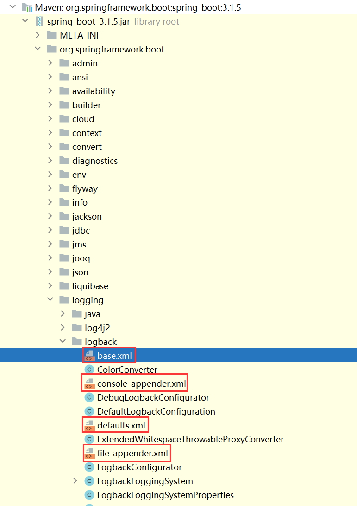

## AOP

[https://docs.spring.io/spring-boot/docs/current/reference/html/features.html#features.aop](https://docs.spring.io/spring-boot/docs/current/reference/html/features.html#features.aop)

[https://docs.spring.io/spring-framework/reference/core/aop.html](https://docs.spring.io/spring-framework/reference/core/aop.html)

[https://docs.spring.io/spring-framework/reference/core/aop/introduction-defn.html](https://docs.spring.io/spring-framework/reference/core/aop/introduction-defn.html)

[https://docs.spring.io/spring-framework/reference/core/aop/ataspectj.html](https://docs.spring.io/spring-framework/reference/core/aop/ataspectj.html)

AOP（Aspect Oriented Programming）意为：面向切面编程，通过预编译方式和运行期动态代理实现程序功能的统一维护的一种技术。

* 切面（Aspect）：一般是指被@Aspect修饰的类，代表着某一具体功能的AOP逻辑。
* 切入点（Pointcut）：选择对哪些方法进行增强。
* 通知（Advice）：对目标方法的增强，有以下五种增强的类型：
    * 前置通知（@Before）：在方法执行前执行。
    * 后置通知（@After）：在方法执行后执行。
    * 返回通知（@AfterReturning）：在方法正常返回后执行。
    * 异常通知（@AfterThrowing）：在方法抛出异常后执行。
    * 环绕通知（@Around）：相当于try-catch-finally，可以实现以上四种通知。
* 连接点（JoinPoint）：被切入点选中的方法。这些方法会被增强处理。

| 表达式类型    | 功能                                                         |
| ------------- | ------------------------------------------------------------ |
| execution()   | 匹配方法 execution(修饰符 返回值类型 方法名（参数）异常) 修饰符：可选。如public，protected，`*`代表任意修饰符 返回值类型：必选。`*`代表任意返回值类型 方法名：必选。方法名的全路径。单点表示单层路径，双点表示多层路径。`*`代表任意方法 参数：必选。()代表是没有参数；(…)代表是匹配任意数量，任意类型的参数；(java.lang.String)代表接收一个String类型的参数；(java.lang.String…)代表接收任意数量的String类型参数 异常：可选。语法：`throws 异常`，异常是完整的全包名，可以是多个，用逗号分隔 |
| args()        | 匹配入参类型                                                 |
| @args()       | 匹配入参类型上的注解                                         |
| @annotation() | 匹配方法上的注解，括号内写注解定义的全路径，所有加了此注解的方法都会被增强。 |
| within()      | 匹配类路径                                                   |
| @within()     | 匹配类上的注解                                               |
| this()        | 匹配类路径，代理类                                           |
| target()      | 匹配类路径，目标类                                           |
| @target()     | 匹配类上的注解                                               |

## 拦截器和过滤器

HandlerInterceptor

Filter

## Logging

[https://docs.spring.io/spring-boot/docs/current/reference/html/features.html#features.logging](https://docs.spring.io/spring-boot/docs/current/reference/html/features.html#features.logging)

[https://docs.spring.io/spring-boot/docs/current/reference/html/features.html#features.logging.custom-log-configuration](https://docs.spring.io/spring-boot/docs/current/reference/html/features.html#features.logging.custom-log-configuration)

[https://logback.qos.ch/](https://logback.qos.ch/)

