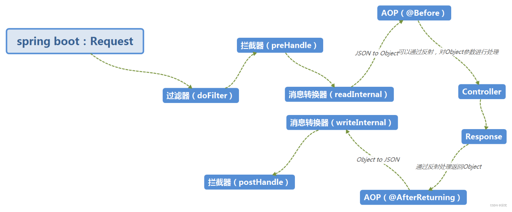

# @SpringBootApplication

```java
@SpringBootConfiguration
@EnableAutoConfiguration
@ComponentScan
public @interface SpringBootApplication {
}

@Configuration
public @interface SpringBootConfiguration {
}

@AutoConfigurationPackage
@Import(AutoConfigurationImportSelector.class)
public @interface EnableAutoConfiguration {
}

public @interface ComponentScan {
    @AliasFor("basePackages")
    String[] value() default {};

    @AliasFor("value")
    String[] basePackages() default {};
}
```

| 注解                     | 说明                                                         |
| ------------------------ | ------------------------------------------------------------ |
| @SpringBootConfiguration | 配置类，相当于@Configuration                                 |
| @EnableAutoConfiguration | 借助@Import的支持，收集和注册特定场景相关的bean定义。        |
| @ComponentScan           | 自动扫描并加载符合条件的组件。Spring框架默认会从声明@ComponentScan所在类的package进行扫描。我们可以通过basePackages等属性控制@ComponentScan扫描范围。 |

# Bean 注册方式

## @Component, @Controller, @Service, @Repository标记类

使用 @Component、@Controller、@Service、@Repository 注解标记类，并将类放在 @ComponentScan 的扫描范围内。

@RestController 是组合注解， @Controller + @ResponseBody。

@ResponseBody 将方法返回结果通过适当的转换器转换为指定的格式（JSON数据或者XML数据），直接写入 HTTP response body 中，使用此注解之后不会再走视图处理器。

## @Configuration标记类 + @Bean标记方法

## @Import

参考：cn.maiaimei.example.config.BeanConfig

# Bean 依赖注入

## 构造器注入

<span style="color:red;">If a bean has more than one constructor, you will need to mark the one you want Spring to use
with @Autowired</span>

## 属性注入

<span style="color:red;">Field injection is not recommended</span>

## Setter方法注入

## @Autowired, @Resource, @Inject

- @Autowired 按byType自动注入；@Resource 按byName自动注入；@Inject 按byType自动注入 。
- @Autowired 是 spring 提供的注解；@Resource 是JDK自带的注解；@Inject 是JSR 330中的规范，需要导入javax.inject包。
- @Autowired
  在根据类型进行自动装配时，如果该类型存在多个不同名称的Bean，则会按照名称进行匹配，如果属性名称与Bean名称相同则装配成功，否则失败。如果需要按指定名称进行装配，则需要配合@Qualifier注解，可以解决“Could not
  autowire. There is more than one bean of 'Xxx' type.”
- @Autowired 有个属性为required，可以配置为false。如果配置为false，当没有找到相应Bean时，系统不会报错。
- @Autowired 通过 “ AutowiredAnnotationBeanPostProcessor ” 类实现的依赖注入。
- @Inject 在根据类型进行自动装配时，如果需要按指定名称进行装配，则需要配合@Named注解。

参考：cn.maiaimei.example.BeanDependencyInjection

[https://docs.spring.io/spring-framework/docs/current/reference/html/core.html#beans-standard-annotations](https://docs.spring.io/spring-framework/docs/current/reference/html/core.html#beans-standard-annotations)

# Bean 生命周期

创建到销毁的过程...参考：cn.maiaimei.example.BeanLifeCycle

# Application Events and Listeners

[https://docs.spring.io/spring-boot/docs/current/reference/html/features.html#features.spring-application.application-events-and-listeners](https://docs.spring.io/spring-boot/docs/current/reference/html/features.html#features.spring-application.application-events-and-listeners)

## 自定义事件

1. 定义事件：继承```ApplicationEvent```
2. 监听事件：  
   2.1 ```@Component```标记类 + ```@EventListener```标记方法 + ```@Order```标记方法（可选）  
   2.2 ```@Component```标记类 + 实现```ApplicationListener``` + ```@Order```标记类（可选）  
   2.3
   在类路径下添加META-INF/spring.factories文件，写入键值对org.springframework.context.ApplicationListener=com.example.project.MyListener + 实现```ApplicationListener```接口 + ```@Order```标记类（可选）
3. 发布事件：注入```ApplicationContext```或```ApplicationEventPublisher```实例，调用```publishEvent```方法

Some events are actually triggered before the ApplicationContext is created, so you cannot register a listener on those
as a @Bean. **You can register them with the SpringApplication.addListeners(…) method or the
SpringApplicationBuilder.listeners(…) method.**

If you want those listeners to be registered automatically, regardless of the way the application is created, you can **
add a META-INF/spring.factories file** to your project and reference your listener(s) by using the
org.springframework.context.ApplicationListener key, as shown in the following example:

**org.springframework.context.ApplicationListener=com.example.project.MyListener**

## 内置事件


Application events are sent in the following order, as your application runs:

An **ApplicationStartingEvent** is sent at the start of a run but before any processing, except for the registration of
listeners and initializers.

An **ApplicationEnvironmentPreparedEvent** is sent when the Environment to be used in the context is known but before
the context is created.

An **ApplicationContextInitializedEvent** is sent when the ApplicationContext is prepared and
ApplicationContextInitializers have been called but before any bean definitions are loaded.

An **ApplicationPreparedEvent** is sent just before the refresh is started but after bean definitions have been loaded.

An **ApplicationStartedEvent** is sent after the context has been refreshed but before any application and command-line
runners have been called.

An **AvailabilityChangeEvent** is sent right after with LivenessState.CORRECT to indicate that the application is
considered as live.

An ApplicationReadyEvent is sent after any application and command-line runners have been called.

An **AvailabilityChangeEvent** is sent right after with ReadinessState.ACCEPTING_TRAFFIC to indicate that the
application is ready to service requests.

An **ApplicationFailedEvent** is sent if there is an exception on startup.

The above list only includes SpringApplicationEvents that are tied to a SpringApplication. In addition to these, the
following events are also published after ApplicationPreparedEvent and before ApplicationStartedEvent:

A **WebServerInitializedEvent** is sent after the WebServer is ready. ServletWebServerInitializedEvent and
ReactiveWebServerInitializedEvent are the servlet and reactive variants respectively.

A **ContextRefreshedEvent** is sent when an ApplicationContext is refreshed.

# ApplicationRunner and CommandLineRunner

If you need to run some specific code once the SpringApplication has started, you can implement the ApplicationRunner or
CommandLineRunner interfaces. Both interfaces work in the same way and offer a single run method, which is called just
before SpringApplication.run(…) completes.

[https://docs.spring.io/spring-boot/docs/current/reference/html/features.html#features.spring-application.command-line-runner](https://docs.spring.io/spring-boot/docs/current/reference/html/features.html#features.spring-application.command-line-runner)

# Filter and Interceptor

Filter依赖于Servlet容器，属于Servlet规范的一部分，拦截器由IoC容器管理，在任何情况下使用。

Filter的执行由Servlet容器回调完成，而拦截器通常通过动态代理的方式来执行。

Filter的生命周期由Servlet容器管理，而拦截器则可以通过IoC容器来管理，因此可以通过注入等方式来获取其他Bean的实例，因此使用会更方便。



[20年全新-Spring Boot 2.x从青铜到王者之钻石篇、filter、interceptor、listener、架构师、SpringBoot](https://www.bilibili.com/video/BV1oZ4y1K7hC)

[Spring Boot实战：拦截器与过滤器](https://www.cnblogs.com/paddix/p/8365558.html)

[SpringBoot拦截器](https://blog.csdn.net/weixin_52120555/article/details/123327175)

# Aware

Aware，能够感知的，实现XxxAware接口的类，能够获取到Xxx的功能。


常用Aware：

| 接口                           | 作用                               | 例子                    |
| ------------------------------ | ---------------------------------- | ----------------------- |
| ApplicationContextAware        | 获得应用上下文                     | ApplicationContextUtils |
| ApplicationEventPublisherAware | 获得应用事件发布器                 |                         |
| BeanClassLoaderAware           | 获得类加载器                       |                         |
| BeanFactoryAware               | 获得Bean工厂                       |                         |
| BeanNameWare                   | 获得容器中Bean名称                 |                         |
| EmbeddedValueResolverAware     | 获得容器加载的properties文件属性值 |                         |
| EnvironmentAware               | 获得环境变量                       |                         |
| MessageSourceAware             | 获得文本信息                       |                         |
| ResourceLoaderAware            | 获得资源加载器                     |                         |

Aware调用链：


# AOP

一、Advice(通知、切面)： 某个连接点所采用的处理逻辑，也就是向连接点注入的代码。

- @Before： 前置增强，相当于BeforeAdvice。
- @After： 最终增强，不管是正常退出或者抛出异常都会执行。
- @AfterReturning： 后置增强，相当于AfterReturningAdvice, 方法正常退出时执行。
- @AfterThrowing： 异常抛出增强，相当于ThrowsAdvice。
- @Around： 环绕增强，相当于MethodInterceptor。

二、JointPoint(连接点)：程序运行中的某个阶段点，比如方法的调用、异常的抛出等。

```
org.aspectj.lang.JoinPoint
org.aspectj.lang.ProceedingJoinPoint
```

三、Pointcut(切入点)： JoinPoint的集合，是程序中需要注入Advice的位置的集合，指明Advice要在什么样的条件下才能被触发，在程序中主要体现为书写切入点表达式。

- execution：用于匹配方法执行的连接点；

  ```
  execution(修饰符匹配? 返回值匹配 类路径匹配? 方法名匹配(参数匹配)异常类型匹配?) 
  execution(modifiers-pattern? ret-type-pattern declaring-type-pattern? name-pattern(param-pattern)throws-pattern?) 
  
  * 表示任何返回值，全路径的类名等
  … 表示包及其子包，包及其子包的任意类的任意方法，零个或多个任意参数等
  
  拦截所有 controller 请求：
  execution(* *.*.controller..*.*(..))
  ```

- within：用于匹配指定类型内的方法执行；

- this：用于匹配当前AOP代理对象类型的执行方法；注意是AOP代理对象的类型匹配，这样就可能包括引入接口也类型匹配；

- target：用于匹配当前目标对象类型的执行方法；注意是目标对象的类型匹配，这样就不包括引入接口也类型匹配；

- args：用于匹配当前执行的方法传入的参数为指定类型的执行方法；

- @within：用于匹配所有持有指定注解类型内的方法；

  ```
  带有@Transactional标注的所有类的任意方法：
  @within(org.springframework.transaction.annotation.Transactional)
  ```

- @target：用于匹配当前目标对象类型的执行方法，其中目标对象持有指定的注解；

  ```
  带有@Transactional标注的所有类的任意方法：
  @target(org.springframework.transaction.annotation.Transactional)
  ```

- @annotation：用于匹配当前执行方法持有指定注解的方法；

  ```
  带有@Transactional标注的任意方法：@annotation(org.springframework.transaction.annotation.Transactional)
  ```

- @args：用于匹配当前执行的方法传入的参数持有指定注解的执行；

  ```
  参数带有@Transactional标注的方法：
  @args(org.springframework.transaction.annotation.Transactional)
  ```

> @within和@target针对类的注解
>
> @annotation是针对方法的注解

```java
import cn.maiaimei.example.constant.GlobalConstant;
import org.aspectj.lang.ProceedingJoinPoint;
import org.aspectj.lang.annotation.Around;
import org.aspectj.lang.annotation.Aspect;
import org.aspectj.lang.annotation.Pointcut;
import org.slf4j.Logger;
import org.slf4j.LoggerFactory;
import org.slf4j.MDC;
import org.springframework.stereotype.Component;

import java.util.UUID;

@Aspect
@Component
public class JobAspect {
    private static final Logger log = LoggerFactory.getLogger(JobAspect.class);

    @Pointcut("@annotation(org.springframework.scheduling.annotation.Scheduled)")
    public void pointcut() {
    }

    @Around("pointcut()")
    public Object around(ProceedingJoinPoint pjp) throws Throwable {
        MDC.put(GlobalConstant.TRACE_ID, UUID.randomUUID().toString().replaceAll("-", ""));
        String name = pjp.getSignature().getName();
        Object[] args = pjp.getArgs();
        Object result = null;
        try {
            // @Before
            log.info("【环绕前置通知】【{}方法开始】", name);
            // 相当于method.invoke(obj,args)，通过反射来执行接口中的方法
            result = pjp.proceed();
            // @AfterReturning
            log.info("【环绕返回通知】【{}方法返回】，返回值：{}", name, result);
        } catch (Exception e) {
            // @AfterThrowing
            log.error("【环绕异常通知】【{}方法异常】，参数：{}", name, args, e);
        } finally {
            // @After
            log.info("【环绕后置通知】【{}方法结束】", name);
            MDC.remove(GlobalConstant.TRACE_ID);
        }
        return result;
    }
}
```

# 配置文件

## 配置优先级


## 多环境配置

<span style="color:red;font-weight:bold;">单一配置文件多环境配置，不同环境以“---”分隔</span>

SpringBoot2.4.2之前写法

```yaml
# 默认配置
spring:
  profiles:
    active: test # 激活测试环境
---
# 开发环境
spring:
  profiles: dev
server:
  port: 8081
---
# 测试环境
spring:
  profiles: test
server:
  port: 8082
---
# 生产环境
spring:
  profiles: prod
server:
  port: 8083
```

SpringBoot2.4.2及之后写法

```yaml
# 默认配置
spring:
  profiles:
    active: test  # 激活测试环境
    include: swagger
---
# 开发环境
spring:
  config:
    activate:
      on-profile: dev
server:
  port: 8081
---
# 测试环境
spring:
  config:
    activate:
      on-profile: test
server:
  port: 8082
---
# 生产环境
spring:
  config:
    activate:
      on-profile: prod
server:
  port: 8083
```

<span style="color:red;font-weight:bold;">多个配置文件多环境配置（一）</span>

application.yml

```yaml
# 默认配置
spring:
  profiles:
  	# 激活测试环境
    active: test
    # 导入其他配置
    include: swagger
```

application-test.yml，application-dev.yml、application-uat.yml、application-prod.yml以此类推。

```yaml
# 测试环境
spring:
  config:
    activate:
      on-profile: test
server:
  port: 8082
```

<span style="color:red;font-weight:bold;">多个配置文件多环境配置（二）</span>

```yaml
spring:
  profiles:
    # 激活XX环境
    active: dev
    # 多环境配置
    group:
      # 本地环境（测试用例）
      local: localH2,mybatisplus,swagger
      # 开发环境（默认）
      dev: devH2,mybatisplus,swagger
      # 测试环境
      test: devH2,mybatisplus,swagger
      # 验收测试环境
      uat: devH2,mybatisplus,swagger
      # 生产环境
      prod: devH2,mybatisplus,swagger
```

<span style="color:red;font-weight:bold;">多个配置文件多环境配置（三）</span>

```yaml
spring:
  profiles:
    # 激活XX环境
    active: dev
    # 导入公共配置
    include: mybatisplus,swagger
    # 多环境配置
    group:
      # 本地环境（测试用例）
      local: localH2
      # 开发环境（默认）
      dev: devH2
      # 测试环境
      test: testH2
      # 验收测试环境
      uat: uatH2
      # 生产环境
      prod: prodH2
```

<span style="color:red;font-weight:bold;">spring.profiles.active 和 spring.profiles.include</span>

```spring.profiles.active``` 用于切换多环境（选择目前激活的是哪个环境）；

```spring.profiles.include``` 用于引入公共的配置文件。

1. ```spring.profiles.active``` 与环境有关的，```spring.profiles.include``` 与环境无关的。

2. The properties from spring.profile.include override default properties. The properties from active profiles override spring.profile.include and default properties.

3. ```spring.profiles.include``` 用于抽取公共配置，比如h2，mybatis-plus，redis等等

   ```yaml
   spring:
     profiles:
       # 导入其他配置（本处以eureka，feign为例）
       include: eureka,feign
   ```

## 命令行参数

启动Spring Boot项目时传递参数，有三种参数形式：

1. 选项参数（见 <span style="color:red;font-weight:bold;">java -jar xxx.jar  --xxx=yyy</span>）
2. 非选项参数（如 <span style="color:red;font-weight:bold;">java -jar xxx.jar xxx yyy</span>）
3. 系统参数（见 <span style="color:red;font-weight:bold;">java -Dxxx=yyy -jar xxx.jar</span>）

<span style="color:red;font-weight:bold;">java -Dxxx=yyy -jar xxx.jar</span>

1. -Dxxx=yyy必须在-jar之前；
2. 此法增加的参数被设置到应用的系统属性中，可通过System.getProperty(“server.port”)获取。

<span style="color:red;font-weight:bold;">java -jar xxx.jar  --xxx=yyy</span>

1. --xxx=yyy必须在-jar之后；
2. 此法增加的参数属于命令行参数，会作为SpringBoot启动的main方法的String[] args参数；
3. 有时在Windows下无效。

If you need to access the application arguments that were passed to SpringApplication.run(…), you can inject a org.springframework.boot.ApplicationArguments bean. **The ApplicationArguments interface provides access to both the raw String[] arguments as well as parsed option and non-option arguments**, as shown in the following example:


[https://docs.spring.io/spring-boot/docs/current/reference/html/features.html#features.spring-application.application-arguments](https://docs.spring.io/spring-boot/docs/current/reference/html/features.html#features.spring-application.application-arguments)

# 接口返回值统一处理

# 异常处理

## ErrorMvcAutoConfiguration

org.springframework.boot.autoconfigure.web.servlet.error.**ErrorMvcAutoConfiguration**，往容器放了以下Bean：

- org.springframework.boot.web.servlet.error.**DefaultErrorAttributes**：将异常放在请求域中
- org.springframework.boot.autoconfigure.web.servlet.error.**BasicErrorController**：处理 /error 请求
- org.springframework.boot.autoconfigure.web.servlet.error.ErrorMvcAutoConfiguration.**
  WhitelabelErrorViewConfiguration**：生成默认错误页

## 异常处理流程

org.springframework.web.servlet.**DispatcherServlet**

```java
public class DispatcherServlet extends FrameworkServlet {
    protected void doDispatch(HttpServletRequest request, HttpServletResponse response) throws Exception {
        HttpServletRequest processedRequest = request;
        HandlerExecutionChain mappedHandler = null;
        boolean multipartRequestParsed = false;

        WebAsyncManager asyncManager = WebAsyncUtils.getAsyncManager(request);

        try {
            ModelAndView mv = null;
            Exception dispatchException = null;

            try {
                // 执行目标方法
                mv = ha.handle(processedRequest, response, mappedHandler.getHandler());
            } catch (Exception ex) {
                dispatchException = ex;
            } catch (Throwable err) {
                dispatchException = new NestedServletException("Handler dispatch failed", err);
            }
            // 如果发生异常，mv为null，dispatchException非null
            processDispatchResult(processedRequest, response, mappedHandler, mv, dispatchException);
        } catch (Exception ex) {
        } catch (Throwable err) {
        } finally {
        }
    }

    private void processDispatchResult(HttpServletRequest request, HttpServletResponse response,
                                       @Nullable HandlerExecutionChain mappedHandler, @Nullable ModelAndView mv,
                                       @Nullable Exception exception) throws Exception {

        boolean errorView = false;

        if (exception != null) {
            if (exception instanceof ModelAndViewDefiningException) {
                mv = ((ModelAndViewDefiningException) exception).getModelAndView();
            } else {
                Object handler = (mappedHandler != null ? mappedHandler.getHandler() : null);
                // 处理异常
                mv = processHandlerException(request, response, handler, exception);
                errorView = (mv != null);
            }
        }
    }

    protected ModelAndView processHandlerException(HttpServletRequest request, HttpServletResponse response,
                                                   @Nullable Object handler, Exception ex) throws Exception {
        ModelAndView exMv = null;
        // this.handlerExceptionResolvers 有两个，分别是：
        // org.springframework.boot.web.servlet.error.DefaultErrorAttributes
        // org.springframework.web.servlet.handler.HandlerExceptionResolverComposite
        if (this.handlerExceptionResolvers != null) {
            for (HandlerExceptionResolver resolver : this.handlerExceptionResolvers) {
                exMv = resolver.resolveException(request, response, handler, ex);
                if (exMv != null) {
                    break;
                }
            }
        }
        // 如果异常解析器无法处理异常，则Spring在底层给Tomcat发出一个“/error”请求
        throw ex;
    }
}
```

org.springframework.boot.web.servlet.error.**DefaultErrorAttributes**

```java
public class DefaultErrorAttributes implements ErrorAttributes, HandlerExceptionResolver, Ordered {
    public ModelAndView resolveException(HttpServletRequest request, HttpServletResponse response, Object handler, Exception ex) {
        // 往 request 域放一个属性
        this.storeErrorAttributes(request, ex);
        return null;
    }

    private void storeErrorAttributes(HttpServletRequest request, Exception ex) {
        request.setAttribute(ERROR_INTERNAL_ATTRIBUTE, ex);
    }
}
```

org.springframework.web.servlet.handler.**HandlerExceptionResolverComposite**

```java
public class HandlerExceptionResolverComposite implements HandlerExceptionResolver, Ordered {
    public ModelAndView resolveException(
            HttpServletRequest request, HttpServletResponse response, @Nullable Object handler, Exception ex) {

        if (this.resolvers != null) {
            /*
             1. org.springframework.web.servlet.mvc.method.annotation.ExceptionHandlerExceptionResolver -> 解析 @ExceptionHandler 注解
             2. org.springframework.web.servlet.mvc.annotation.ResponseStatusExceptionResolver -> 解析 @ResponseStatus 注解
             3. org.springframework.web.servlet.mvc.support.DefaultHandlerExceptionResolver -> 解析标准 Spring MVC 异常
             */
            for (HandlerExceptionResolver handlerExceptionResolver : this.resolvers) {
                ModelAndView mav = handlerExceptionResolver.resolveException(request, response, handler, ex);
                if (mav != null) {
                    return mav;
                }
            }
        }
        return null;
    }
}
```

## 全局异常处理

# 日志

By default, if you use the “Starters”, Logback is used for logging.


By default, Spring Boot logs only to the console and does not write log files. If you want to write log files in
addition to the console output, you need to set a `logging.file.name` or `logging.file.path` property (for example, in
your `application.properties`).

Log files rotate when they reach 10 MB and, as with console output, `ERROR`-level, `WARN`-level, and `INFO`-level
messages are logged by default.

When possible, we recommend that you use the `-spring` variants for your logging configuration (for
example, `logback-spring.xml` rather than `logback.xml`)

[https://docs.spring.io/spring-boot/docs/current/reference/html/features.html#features.logging](https://docs.spring.io/spring-boot/docs/current/reference/html/features.html#features.logging)

[https://logback.qos.ch/](https://logback.qos.ch/)

[在SpringBoot中缓存HTTP请求响应体(实现请求响应日志的记录)](https://www.cnblogs.com/kevinblandy/p/14742800.html)

[Logback及其MDC功能详解](https://blog.csdn.net/taiyangdao/article/details/82860499)

[如何追踪Spring MVC接口的请求响应](https://zhuanlan.zhihu.com/p/399672928)

# 参数解析器

```java
public interface HandlerMethodArgumentResolver {
    // 判断方法参数是否可以被当前解析器解析
	boolean supportsParameter(MethodParameter parameter);
    // 解析参数
	Object resolveArgument(MethodParameter parameter, @Nullable ModelAndViewContainer mavContainer,
			NativeWebRequest webRequest, @Nullable WebDataBinderFactory binderFactory) throws Exception;
}
```

[springmvc--6--RequestResponseBodyMethodProcessor处理@RequestBody注解和@ResponseBody注解](https://blog.csdn.net/qq_33012981/article/details/113860575)

# 返回值处理器

```java
public interface HandlerMethodReturnValueHandler {
	boolean supportsReturnType(MethodParameter returnType);
	void handleReturnValue(@Nullable Object returnValue, MethodParameter returnType,
			ModelAndViewContainer mavContainer, NativeWebRequest webRequest) throws Exception;
}
```
