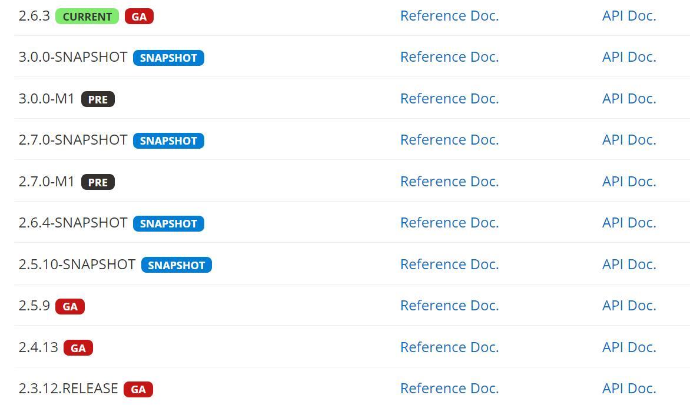
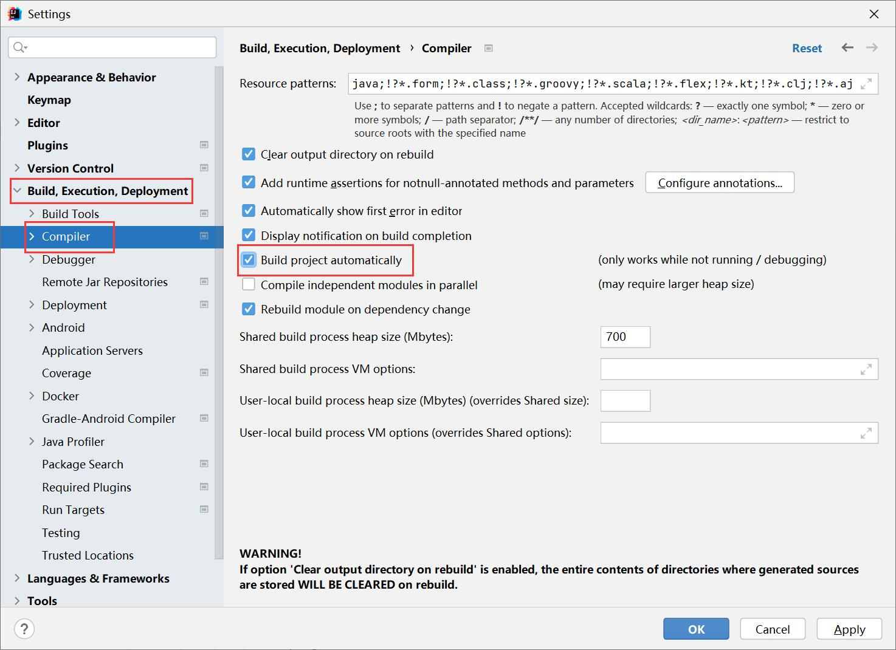
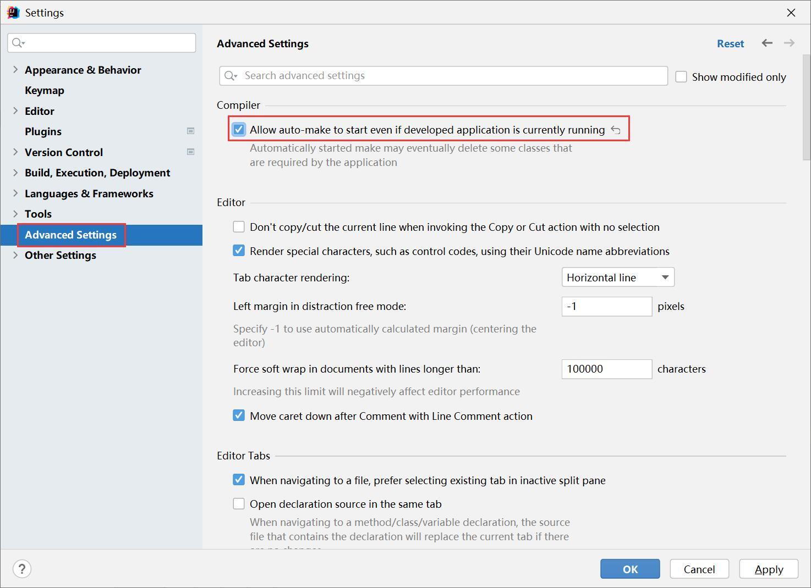

[Spring Boot Reference Documentation](https://docs.spring.io/spring-boot/docs/current/reference/html/)

[Getting Started](https://docs.spring.io/spring-boot/docs/current/reference/html/getting-started.html)

[Using Spring Boot](https://docs.spring.io/spring-boot/docs/current/reference/html/using.html)

[Spring Boot Maven Plugin Documentation](https://docs.spring.io/spring-boot/docs/2.6.3/maven-plugin/reference/htmlsingle/)

# Inheriting the Starter Parent POM

Maven users can inherit from the **spring-boot-starter-parent** project to obtain sensible defaults. The parent project provides the following features:

- Java 1.8 as the default compiler level.
- UTF-8 source encoding.
- Compilation with -parameters.
- A dependency management section, inherited from the spring-boot-dependencies POM, that manages the versions of common dependencies. This dependency management lets you omit <version> tags for those dependencies when used in your own POM.
- An execution of the repackage goal with a repackage execution id.
- Sensible resource filtering.
- Sensible plugin configuration (Git commit ID, and shade).
- Sensible resource filtering for application.properties and application.yml including profile-specific files (for example, application-dev.properties and application-dev.yml)

> Since the `application.properties` and `application.yml` files accept Spring style placeholders (`${…}`), the Maven filtering is changed to use `@..@` placeholders. (You can override that by setting a Maven property called `resource.delimiter`.)

<span style="color:red">详见 pom.bak.xml</span>

# Using Spring Boot without the Parent POM

<span style="color:red">详见 pom.xml</span>

# 版本说明



| X                             | 说明                                                       |
| ----------------------------- | ---------------------------------------------------------- |
| 第一个数字                    | 主版本，有可能进行大的架构调整，各大版本之间不一定兼容     |
| 第二个数字                    | 次版本，在主版本架构不变的前提下，增加了一些新的特性或变化 |
| 第三个数字                    | 增量版本，修复缺陷，完善细节                               |
| SNAPSHOT                      | 快照版本，开发版本，随时可能修改                           |
| M1...MX（Milestone）          | 里程碑版本，测试版本，发布版本的前兆                       |
| PRE                           | 里程碑版/预览版本                                          |
| RC1…RCX（Release Candidates） | 发布预览版本，稳定版本，并不一定会发布                     |
| RELEASE                       | 发布版本，稳定版本，在项目中真正可用的版本                 |
| SR1…SRX（Service Release）    | 修正版，优先对于RELEASE版本的问题进行修复                  |
| GA（General Availability）    | 稳定版，可用于生产                                         |

SNAPSHOT → M1…MX → RC1…RCX → release → SR1…SRX

# 热部署

引入依赖

```xml
<dependency>
    <groupId>org.springframework.boot</groupId>
    <artifactId>spring-boot-devtools</artifactId>
    <optional>true</optional>
</dependency>
```

IDEA 2021版本配置，File -> settings




