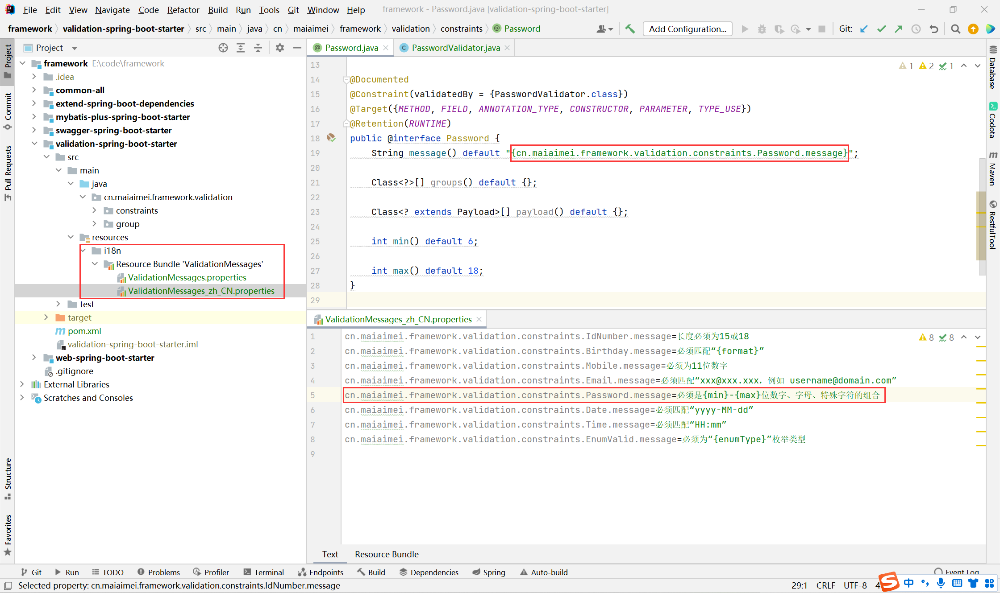
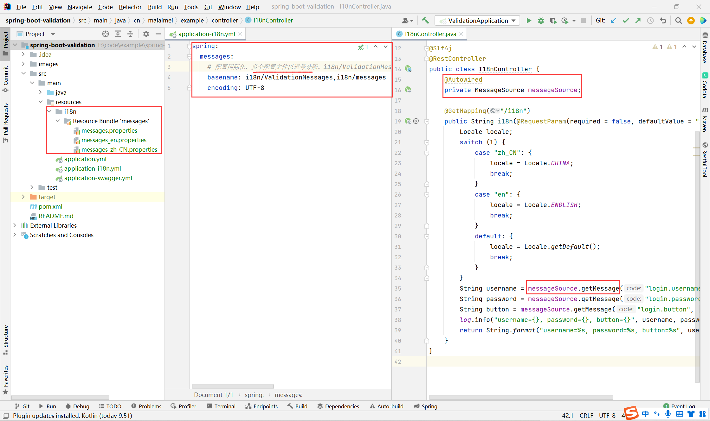

# 自定义验证规则

```java
@Documented
@Constraint(validatedBy = {PasswordValidator.class})
@Target({METHOD, FIELD, ANNOTATION_TYPE, CONSTRUCTOR, PARAMETER, TYPE_USE})
@Retention(RUNTIME)
public @interface Password {
    String message() default "{cn.maiaimei.framework.validation.constraints.Password.message}";

    Class<?>[] groups() default {};

    Class<? extends Payload>[] payload() default {};

    int min() default 6;

    int max() default 18;
}
```

```java
public class PasswordValidator implements ConstraintValidator<Password, String> {
    private RegexUtils.PasswordType type;
    private int min;
    private int max;

    @Override
    public void initialize(Password constraintAnnotation) {
        this.type = RegexUtils.PasswordType.CONTAIN_ALPHABET_NUMBER_SYMBOL;
        this.min = constraintAnnotation.min();
        this.max = constraintAnnotation.max();
    }

    @Override
    public boolean isValid(String value, ConstraintValidatorContext context) {
        if (StringUtils.isNotBlank(value)) {
            return RegexUtils.isValidPassword(type, value, min, max);
        }
        return true;
    }
}
```

# 多字段联合校验

```java
@GroupSequenceProvider(value = LeaveSequenceProvider.class)
@Data
public class LeaveRequest {
    @NotNull(groups = {ValidationGroup.OrderA.class})
    @EnumValid(enumType = LeaveType.class)
    private String type;

    @NotNull(groups = {WhenTypeIsInLieuLeave.class})
    private Long workOvertimeId;

    public interface WhenTypeIsInLieuLeave {
    }
}
```

```java
public class LeaveSequenceProvider implements DefaultGroupSequenceProvider<LeaveRequest> {
    @Override
    public List<Class<?>> getValidationGroups(LeaveRequest leaveRequest) {
        List<Class<?>> defaultGroupSequence = new ArrayList<>();
        defaultGroupSequence.add(LeaveRequest.class);

        if (leaveRequest != null) {
            // 当请假类型为调休假（IN_LIEU_LEAVE）时，加班ID（workOvertimeId不能为NULL）
            if (LeaveType.IN_LIEU_LEAVE.equals(leaveRequest.getType())) {
                defaultGroupSequence.add(LeaveRequest.WhenTypeIsInLieuLeave.class);
            }
        }

        return defaultGroupSequence;
    }
}
```

# 国际化配置



