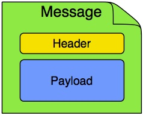
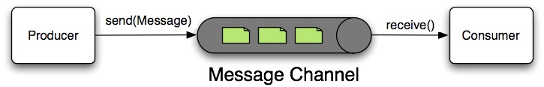
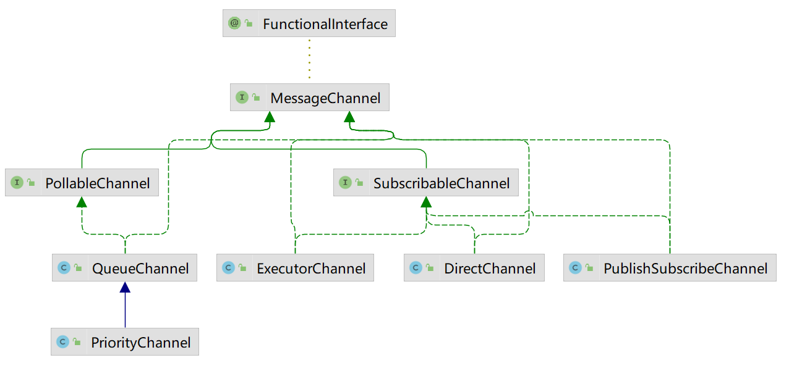

# Spring Integration

[Spring Integration](https://spring.io/projects/spring-integration) 是一个轻量级的集成框架。

[https://docs.spring.io/spring-integration/docs/current/reference/html/index.html](https://docs.spring.io/spring-integration/docs/current/reference/html/index.html)

[https://docs.spring.io/spring-integration/docs/current/reference/html/overview.html#overview-components](https://docs.spring.io/spring-integration/docs/current/reference/html/overview.html#overview-components)

## Message

Message：即消息本身，它由Header和Payload两部分组成。

Header包含了消息的元数据信息，同时Header也常用于Http、Mail等其他消息头部的转换。

Payload是对任意Java对象的包装。

其基接口为 Message<T> ，需要注意的是通用的消息实现是不可变的。



## Message Channel

Message Channel：消息传输的载体。



- 从消费者角度来说，Message Channel可以分为point-to-point(点对点) 和publish-subscribe(发布订阅)两种。

- 从通道是否保存消息的角度来说，Message Channel分为Pollable Channel和Subscribable Channel两种。

  * Pollable Channel：保存消息，消费者需要主动拉取消息，核心接口为 PollableChannel 。

  * Subscribable Channel：可订阅型通道，不存储消息，消费者被动通知消息，核心接口为 SubscribableChannel 。



[https://docs.spring.io/spring-integration/docs/current/reference/html/channel.html#channel-implementations](https://docs.spring.io/spring-integration/docs/current/reference/html/channel.html#channel-implementations)

[https://docs.spring.io/spring-integration/docs/current/reference/html/channel.html#channel-interceptors](https://docs.spring.io/spring-integration/docs/current/reference/html/channel.html#channel-interceptors)

```
<int:channel id= "someChannel" ... />

@Bean
public MessageChannel someChannel() {
	return new QueueChannel(100);
}
```

## Message Endoint

- Message Transformer：消息转换器，用于转换消息内容和格式。

- Message Filter：消息过滤器，判断一个消息是否应该被传输。

  ```
  @org.springframework.integration.annotation.Filter
  ```

- Message Router：消息路由器，用于判断将消息发往哪个通道。

  ```
  @org.springframework.integration.annotation.Router

- Splitter：消息分割器，用于将单个消息分割为多个消息。

  ```
  @org.springframework.integration.annotation.Splitter
  ```

- Aggregator：与Splitter相反，将多个消息聚合为一个消息。

  ```
  @org.springframework.integration.annotation.Transformer
  ```

- Service Activator：消息最终的消费方。可调用Spring的Bean来处理消息，并将处理后的结果输出到指定的消息通道。

  ```
  <int:service-activator id="someService" ... />
  @org.springframework.integration.annotation.ServiceActivator
  ```

- Channel Adapter：通道适配器，用于单向集成，可以是输入也可以是输出。入站适配器位于流的开头，出站适配器终止流。

  ```
  <int:inbound-channel-adapter id= "someAdapter" ... />
  @org.springframework.integration.annotation.InboundChannelAdapter
  ```

- Gateway：网关，类似于Channel Adapter，是双向的。

  ```
  @org.springframework.integration.annotation.Gateway
  ```

# Spring Integration Samples

[https://github.com/spring-projects/spring-integration-samples](https://github.com/spring-projects/spring-integration-samples)
