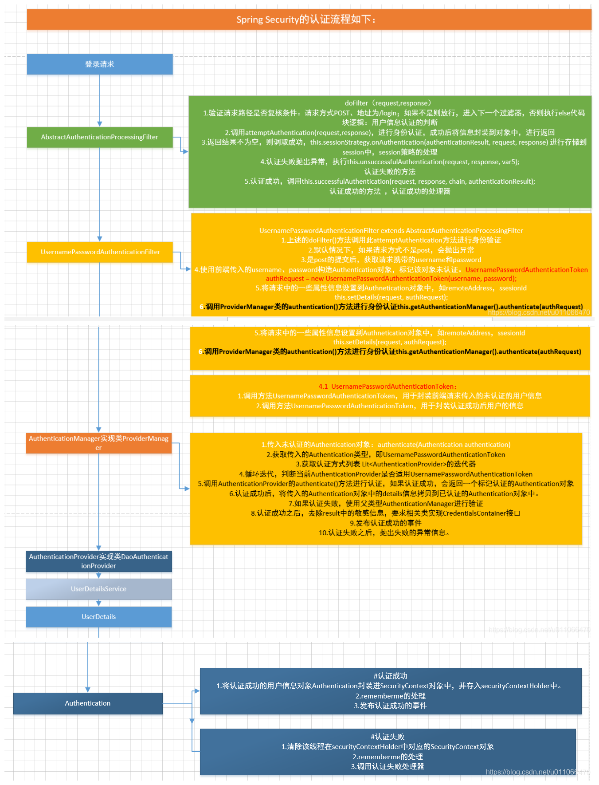
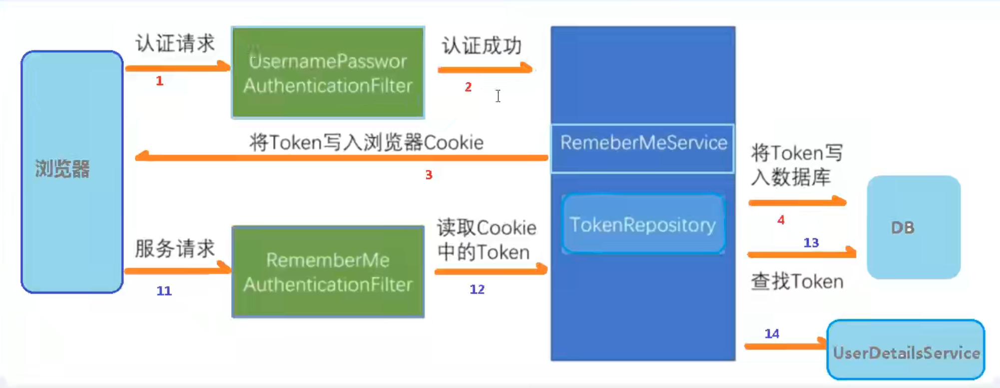

# Spring Security

## Summary

[Spring Security 原理](https://segmentfault.com/a/1190000018616620)

[Spring Security 认证和授权流程](https://blog.csdn.net/u011066470/article/details/119086893)

Spring Security 基本都是通过过滤器来完成配置的身份认证、权限认证以及登出。

Spring Security 在 Servlet 的过滤链（filter chain）中注册了一个过滤器 FilterChainProxy，它会把请求代理到 Spring Security 自己维护的多个过滤链，每个过滤链会匹配一些 URL，如果匹配则执行对应的过滤器。过滤链是有顺序的，一个请求只会执行第一条匹配的过滤链。Spring Security 的配置本质上就是新增、删除、修改过滤器。

```java
public class FilterChainProxy extends GenericFilterBean {
    @Override
    public void doFilter(ServletRequest request, ServletResponse response, FilterChain chain)
        throws IOException, ServletException {
        doFilterInternal(request, response, chain);
    }

    private void doFilterInternal(ServletRequest request, ServletResponse response, FilterChain chain)
        throws IOException, ServletException {
        FirewalledRequest firewallRequest = this.firewall.getFirewalledRequest((HttpServletRequest) request);
        HttpServletResponse firewallResponse = this.firewall.getFirewalledResponse((HttpServletResponse) response);
        List<Filter> filters = getFilters(firewallRequest);
        VirtualFilterChain virtualFilterChain = new VirtualFilterChain(firewallRequest, chain, filters);
        virtualFilterChain.doFilter(firewallRequest, firewallResponse);
    }

    private static final class VirtualFilterChain implements FilterChain {
        @Override
        public void doFilter(ServletRequest request, ServletResponse response) throws IOException, ServletException {
            if (this.currentPosition == this.size) {
                this.originalChain.doFilter(request, response);
                return;
            }
            this.currentPosition++;
            Filter nextFilter = this.additionalFilters.get(this.currentPosition - 1);
            nextFilter.doFilter(request, response, this);
        }
    }
}
```
默认的 filters ：
|      | Filter                                  | Description                                                  |
| ---- | --------------------------------------- | ------------------------------------------------------------ |
| 1    | WebAsyncManagerIntegrationFilter        | 将 Security 上下文与 Spring Web 中用于处理异步请求映射的 WebAsyncManager 进行集成。 |
| 2    | SecurityContextPersistenceFilter        | 在每次请求处理之前将该请求相关的安全上下文信息加载到 SecurityContextHolder 中，然后在该次请求处理完成之后，将 SecurityContextHolder 中关于这次请求的信息存储到一个“仓储”中，然后将 SecurityContextHolder 中的信息清除，例如在 Session 中维护一个用户的安全信息就是这个过滤器处理的。 |
| 3    | HeaderWriterFilter                      | 用于将头信息加入响应中。                                     |
| 4    | LogoutFilter                            | 用于处理退出登录。                                           |
| 5    | UsernamePasswordAuthenticationFilter    | 用于处理基于表单的登录请求，从表单中获取用户名和密码。默认情况下处理来自 /login 的请求。从表单中获取用户名和密码时，默认使用的表单 name 值为 username 和 password，这两个值可以通过设置这个过滤器的 usernameParameter 和 passwordParameter 两个参数的值进行修改。 |
| 6    | DefaultLoginPageGeneratingFilter        | 如果没有配置登录页面，那系统初始化时就会配置这个过滤器，并且用于在需要进行登录时生成一个登录表单页面。 |
| 7    | DefaultLogoutPageGeneratingFilter       | 生成一个默认登出页面。                                       |
| 8    | RequestCacheAwareFilter                 | 用来处理请求的缓存。                                         |
| 9    | SecurityContextHolderAwareRequestFilter | 主要是包装请求对象 request。                                 |
| 10   | RememberMeAuthenticationFilter          | 当用户没有登录而直接访问资源时，从 cookie 里找出用户的信息, 如果 Spring Security 能够识别出用户提供的 remember me cookie，用户将不必填写用户名和密码，而是直接登录进入系统，该过滤器默认不开启。 |
| 11   | AnonymousAuthenticationFilter           | 检测 SecurityContextHolder 中是否存在 Authentication 对象，如果不存在为其提供一个匿名 Authentication。 |
| 12   | SessionManagementFilter                 | 管理 session 的过滤器。                                      |
| 13   | ExceptionTranslationFilter              | 处理 AccessDeniedException 和 AuthenticationException 异常。 |
| 14   | FilterSecurityInterceptor               | 可以看做过滤器链的出口。用于控制方法级别资源。               |

## Authentication

认证流程是在 UsernamePasswordAuthenticationFilter 过滤器中处理的：



记住我/自动登录



## Authorization

授权主要涉及两个过滤器：ExceptionTranslationFilter 过滤器和 FilterSecurityInterceptor 过滤器。

开启方法级别资源控制

```java
@EnableGlobalMethodSecurity(prePostEnabled = true, securedEnabled = true, jsr250Enabled = true)
```

prePostEnabled 用于开启 @PreAuthorize 和 @PostAuthorize 注解功能。 @PreAuthorize 和 @PostAuthorize 同时支持基于角色和基于资源的访问控制。

```java

@RestController
public class UserController {
    @PreAuthorize("hasAuthority('user:add')")
    @PostMapping
    public void create() {
    }

    @PreAuthorize("hasAuthority('user:delete')")
    @PutMapping
    public String update() {
    }

    @PreAuthorize("hasRole('admin')")
    @DeleteMapping
    public String delete() {
    }

    @PreAuthorize("hasRole('admin') or hasRole('manager')")
    @GetMapping
    public String get() {
    }
}
```

securedEnabled 用于开启 @Secured 注解功能。@Secured 只能支持基于角色的访问控制，且必须要加上 ROLE_ 前缀。

```java

@RestController
public class UserController {
    @Secured({"ROLE_admin"})
    @DeleteMapping
    public String delete() {
    }

    @Secured({"ROLE_admin", "ROLE_manager"})
    @GetMapping
    public String get() {
    }
}
```

jsr250Enabled 用于开启 @DenyAll、@PermitAll、@RolesAllowed 等注解功能。

JSR（Java SpecificationRequest）是一种Java注解规范，比如JSR-175、JSR-250、JSR-330。

其中JSR-250是针对资源权限的注解规范，比如@Bean、@Resource、@PostConstruct、@PreDestroy等，这些注解都在Spring中得到了实现。

较常使用的注解有：

- @DenyAll，拒绝所有角色对该资源的访问；
- @PermitAll，允许所有角色对该资源的访问；
- @RolesAllowed，允许指定的角色对该资源的访问；

## CSRF

[https://blog.csdn.net/yjclsx/article/details/80349906](https://blog.csdn.net/yjclsx/article/details/80349906)

## Thymeleaf 对 Spring Security 的支持

Thymeleaf 对 Spring Security 的支持都放在 thymeleaf-extras-springsecurityX 中，目前最新版本为 5

```xml
<dependency>
    <groupId>org.thymeleaf.extras</groupId>
    <artifactId>thymeleaf-extras-springsecurity5</artifactId>
</dependency>
```

在 html 页面中引入 thymeleaf 命名空间和 security 命名空间

```html
<html lang="en" 
      xmlns="http://www.w3.org/1999/xhtml"
      xmlns:th="http://www.thymeleaf.org"
      xmlns:sec="http://www.thymeleaf.org/thymeleaf-extras-springsecurity4" >
</html>
```

在 html 页面中通过```sec:authentication="xxx"```获取```UsernamePasswordAuthenticationToken```及父类中所有getXxx的内容

```java
public class UsernamePasswordAuthenticationToken extends AbstractAuthenticationToken {
    // 登录主体，在自定义登录逻辑中是UserDetails实例
	public Object getPrincipal() {}
    // 登录密码
    public Object getCredentials() {}
}

public abstract class AbstractAuthenticationToken implements Authentication, CredentialsContainer {
	// 登录账号
    public String getName() {}
    // 角色和权限
    public Collection<GrantedAuthority> getAuthorities() {}
    // WebAuthenticationDetails实例，可以获取客户端IP（remoteAddress）和当前SessionId（sessionId）
    public Object getDetails() {}
}
```

# FAQ

[Spring之@EnableRedisHttpSession注解](https://blog.csdn.net/jsbylibo/article/details/106544932)

[SpringSecurity整合SpringSession-Redis 限制用户登录，SpringSecurity单用户登录](https://www.cnblogs.com/nuti/p/12930291.html)

[帅气的 Spring Session 功能，基于 Redis 实现分布式会话，还可以整合 Spring Security！](https://cloud.tencent.com/developer/article/1636204)
