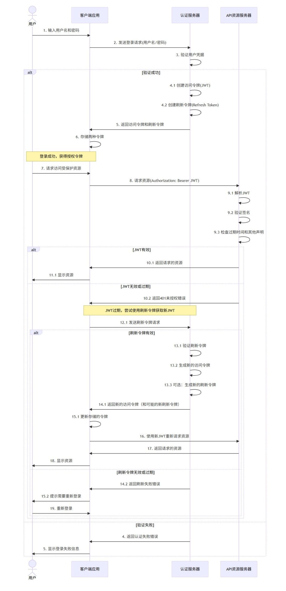

# JWT

## JWT概念

**JWT（JSON Web Token）**是一种开放标准（[RFC 7519](https://tools.ietf.org/html/rfc7519)），用于在各方之间安全地传输信息。JWT以JSON对象的形式存在，通过数字签名保证信息可以被验证和信任。JWT可以使用HMAC算法的密钥或RSA/ECDSA的公钥/私钥对进行签名。

**优点**：

1. 自包含：包含必要的认证和授权信息，减少数据库查询压力
2. 无状态，服务器不需要存储会话信息，减轻服务器存储压力
3. 可扩展：适用于分布式和微服务架构，易于集群或水平扩展
4. 跨平台：几乎所有编程语言都有JWT实现，可用于各种技术栈
5. 可跨域：可以轻松实现跨域认证，适用于前后端分离架构
6. 可传输：体积小，易于在URL、POST参数或HTTP头部传输
7. 标准化：基于开放标准，实现了互操作性

**缺点**：

1. 不可撤销：一旦签发，在过期前无法直接撤销（除非实现黑名单或白名单机制）
2. 载荷大小：过多自定义声明会增加JWT体积，影响网络传输效率，建议不超过1KB
3. 载荷安全：载荷虽然经过编码但不加密，不应存储敏感信息
4. 密钥管理：需要妥善保护签名密钥，一旦泄露将导致严重安全问题
5. 密钥轮换：更新密钥需要额外的机制和策略
6. 安全存储：客户端需要安全存储JWT，防止XSS和CSRF攻击
7. 状态需求：某些情况下（如强制登出所有设备）需要引入状态管理，与JWT无状态特性相悖

## JWT结构

JWT格式由三个部分组成，分别是头部（Header）、载荷（Payload）和签名（Signature），它们之间使用点（.）分隔。

```
Header.Payload.Signature
```

**头部（Header）**：包含令牌类型和使用的签名算法。头部是一个JSON对象，使用Base64Url编码。

```json
{
  "alg": "HS256",
  "typ": "JWT"
}
```

**载荷（Payload）**：包含声明（claims），声明是关于实体（通常是用户）和其他数据的声明。有三种类型的声明：

1. 注册声明（registered claims）：预定义但不强制使用。


| 声明 | 全称            | 说明                                |
| ---- | --------------- | ----------------------------------- |
| sub  | Subject         | 主题，通常为用户ID                  |
| iss  | Issuer          | 签发者                              |
| aud  | Audience        | 接收者                              |
| iat  | Issued At       | 签发时间                            |
| nbf  | Not Before      | 生效时间                            |
| exp  | Expiration time | 过期时间                            |
| jti  | JWT ID          | 编号，为JWT提供唯一标识符，便于撤销 |

2. 公共声明（public claims）：自定义声明，应避免冲突，可在IANA JSON Web Token Registry注册。

3. 私有声明（private claims）：用于特定应用之间共享信息。


载荷也是一个JSON对象，使用Base64Url编码。

**签名（Signature）**：使用指定算法对编码后的头部、载荷和密钥进行签名。

```
HMACSHA256(base64UrlEncode(header) + "." + base64UrlEncode(payload) ,secret)
```

## JWT应用

### 认证授权



**初始认证阶段**：

- 用户提交凭据（登录信息、用户名/密码）到服务器
- 服务器验证凭据，成功后生成两种令牌返回客户端
  - 访问令牌（JWT）：短期有效（通常15分钟至2小时），减少被盗用的风险，内存存储（首选）或sessionStorage（次选），避免使用localStorage，包含必要的用户信息和权限，应在每次页面刷新时从认证服务器获取新的访问令牌
  - 刷新令牌（Refresh Token）：长期有效（几天至几周，如7-30天），减少登录频率，应存储在更安全的位置（如HTTP-only cookie，带有SameSite=Strict和Secure标志），可以与用户代理（User Agent）或设备指纹绑定，防止令牌被盗用，通常仅包含用户ID和过期时间

* 客户端将两种令牌存储在本地存储或Cookie中，后续每次请求都需要在header中携带访问令牌（JWT）

**资源访问阶段**：

- 客户端在请求头中携带访问令牌（JWT）：`Authorization: Bearer [JWT]`
- 资源服务器验证JWT的签名和有效期
- 验证通过后处理请求并返回响应

**令牌刷新机制**：

- 当访问令牌过期时，客户端使用刷新令牌请求新的访问令牌
- 认证服务器验证刷新令牌，生成新的访问令牌（可能还会更新刷新令牌）
- 客户端使用新令牌继续访问资源
- 如果刷新令牌也过期，用户需要重新登录

### 单点登录（SSO）

一次登录，多系统通用。JWT可以在多个系统之间共享，无需在每个系统中重新登录。这对于拥有多个应用的组织特别有用，可以提供无缝的用户体验。

## 参考资料

[https://juejin.cn/post/7485239620579196939](https://juejin.cn/post/7485239620579196939)

[https://developer.aliyun.com/article/1613854](https://developer.aliyun.com/article/1613854)

[https://cloud.tencent.com/developer/article/2430977](https://cloud.tencent.com/developer/article/2430977)